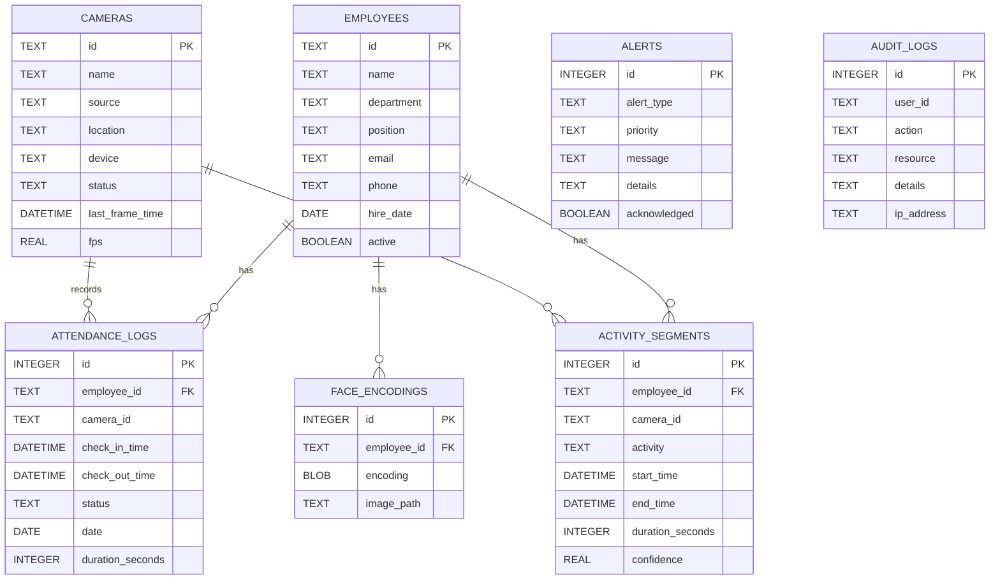

# Entity Relationships (ER)

هذا المستند يوضح العلاقات بين كيانات النظام.

## العلاقات اللفظية
- employees (1) → (N) attendance_logs
- employees (1) → (N) activity_segments
- employees (1) → (N) face_encodings
- cameras (1) → (N) attendance_logs
- cameras (1) → (N) activity_segments
- alerts مستقل لكنها قد تُسند إلى user_id/employee_id مستقبلاً
- audit_logs يسجل كل عمليات الوصول/التعديل (مرتبط بمنفذين وليس بالضرورة موظفين)

## ER Diagram (Mermaid)

## القيود والقواعد
- ATTENDANCE_LOGS.employee_id يجب أن يوجد في EMPLOYEES.id
- ACTIVITY_SEGMENTS.employee_id يجب أن يوجد في EMPLOYEES.id
- FACE_ENCODINGS.employee_id يجب أن يوجد في EMPLOYEES.id
- يفضّل فرض `PRAGMA foreign_keys=ON` في SQLite.
- استخدم معاملات لسلامة الكتابة عند إدخال بيانات متعددة الجداول.
